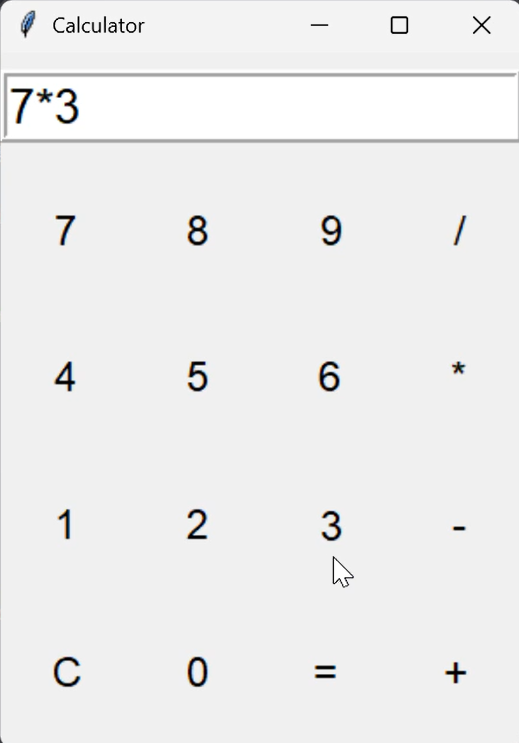

# Simple GUI Calculator using Python Tkinter

A basic calculator app built with Python's `tkinter` module. This project demonstrates the use of event handling, dynamic widget generation, and simple arithmetic logic using Python.

---

## 🚀 Features

- Simple and clean GUI
- Supports basic arithmetic operations: `+`, `-`, `*`, `/`
- Clear (`C`) button to reset input
- Error handling for invalid inputs
- Dynamic button generation using loops

---

## 📸 Screenshot

> 

---

## 🛠 Tech Stack

- **Language:** Python
- **Library:** Tkinter (standard GUI library in Python)

---

## 📁 How to Run

1. Make sure Python is installed (Python 3.x recommended)
2. Save the script as `calculator.py`
3. Run the program:

```bash
python calculator.py
```

---

## 🙌 Author

Made with ❤️ by **Varshini**
